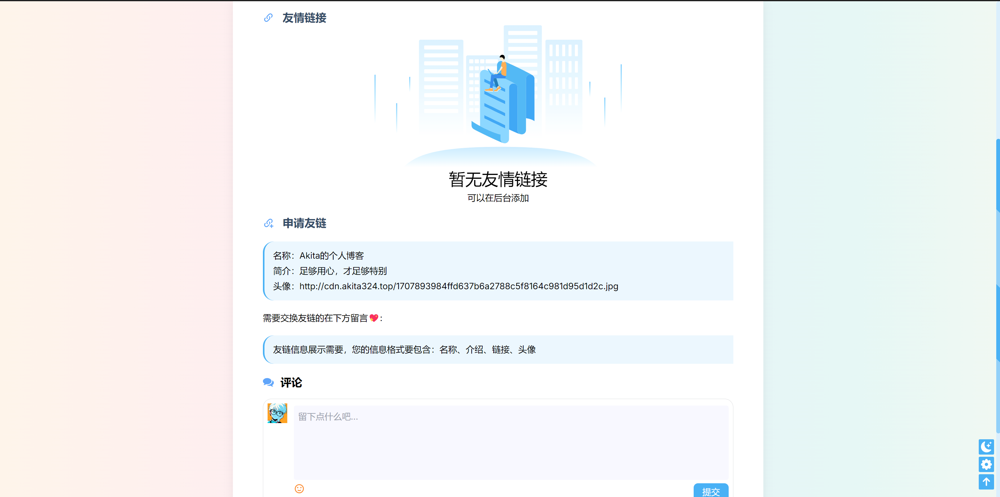
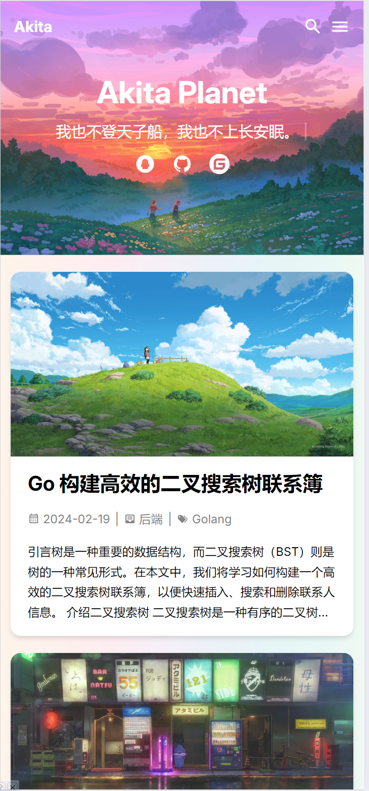
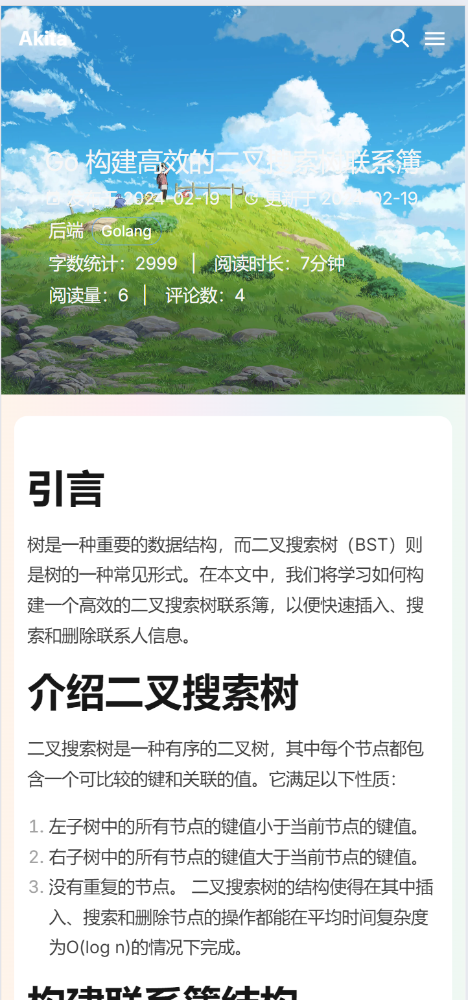

## 项目介绍

本项基于Gin+Gorm+MySQL+Viper+Casbin+Zap+Redis+Vue+vite+TypeScript+Unocss+Naive UI+Nginx+Docker等技术栈搭建

<p align="center">
   <a target="_blank" href="#">
      
      
      
      
      
      
      
    </a>
</p>

## 在线预览

在线接口文档地址：[AkitaPlanet-api](https://apifox.com/apidoc/shared-af22a508-fb18-4c9a-9fc0-32688bcbd277)，准备换成 Swagger

博客前台链接：[http://www.akita324.top](http://www.akita324.top)（已适配移动端）

博客后台链接：[http://www.akita324.top:81](http://www.akita324.top:81)（暂未专门适配移动端）

测试账号：test@qq.com，密码：11111，前后台都可用这个账号登录
admin账号：admin,密码：123456，前后台都可用这个账号登录

## 项目特点

前台：

- 前台界面设计参考 Hexo 的 Butterfly 设计，美观简洁
- 响应式布局，适配了移动端
- 实现点赞，统计用户等功能 (Redis)
- 评论 + 回复评论功能
- 留言采用弹幕墙，效果炫酷
- 文章详情页有文章目录、推荐文章等功能，优化用户体验

后台：

- 鉴权使用 JWT
- 权限管理使用 CASBIN，实现基于 RBAC 的权限管理
- 支持动态权限修改，前端菜单由后端生成（动态路由）
- 文章编辑使用 Markdown 编辑器
- 常规后台功能齐全：侧边栏、面包屑、标签栏等
- 实现记录操作日志功能（GET 不记录）
- 实现监听在线用户、强制下线功能
- 文件上传支持七牛云、本地
- 对 CRUD 操作封装了通用 Hook

其他：

- 采用 Restful 风格的 API
- 前后端分离部署，前端使用 Nginx，后端使用 Docker
- 代码整洁层次清晰，利于开发者学习
- 技术点新颖，代码轻量级，适度封装
- Docker Compose 一键运行，轻松搭建在线博客

## 项目结构

#### 后端目录：简略版

```
AkitaPlanet-server
├── api             -- API
│   ├── front       -- 前台接口
│   └── v1          -- 后台接口
├── dao             -- 数据库操作模块
├── service         -- 服务模块
├── model           -- 数据模型
│   ├── req             -- 请求 VO 模型
│   ├── resp            -- 响应 VO 模型
│   ├── dto             -- 内部传输 DTO 模型
│   └── ...             -- 数据库模型对象 PO 模型
├── routes          -- 路由模块
│   └── middleware      -- 路由中间件
├── utils           -- 工具模块
│   ├── r               -- 响应封装
│   ├── upload          -- 文件上传
│   └── ...
├── routes          -- 路由模块
├── config          -- 配置文件
├── test            -- 测试模块
├── assets          -- 资源文件
├── log             -- 存放日志的目录
├── public          -- 外部访问的静态资源
│   └── uploaded    -- 本地文件上传目录
├── Dockerfile
└── main.gore  

#### 前端目录：简略版

AkitaPlanet-admin / AkitaPlanet-front 通用目录结构
├── src              
│   ├── api             -- 接口
│   ├── assets          -- 静态资源
│   ├── styles          -- 样式
│   ├── components      -- 组件
│   ├── composables     -- 组合式函数
│   ├── router          -- 路由
│   ├── store           -- 状态管理
│   ├── utils           -- 工具方法
│   ├── views           -- 页面
│   ├── App.vue
│   └── main.ts
├── settings         -- 项目配置
├── build            -- 构建相关的配置
├── public           -- 公共资源, 在打包后会被加到 dist 根目录
├── package.json 
├── package-lock.json
├── index.html
├── tsconfig.json
├── unocss.config.ts -- unocss 配置
└── vite.config.ts   -- vite 配置
├── .env             -- 通用环境变量
├── .env.development -- 开发环境变量
├── .env.production  -- 线上环境变量
├── .gitignore
├── .editorconfig    -- 编辑器配置
├── .prettierrc       -- prettier 配置
├── .stylelintrc     -- stylelint 配置
├── README.md
```


## 项目截图
### PC端




### 移动端

